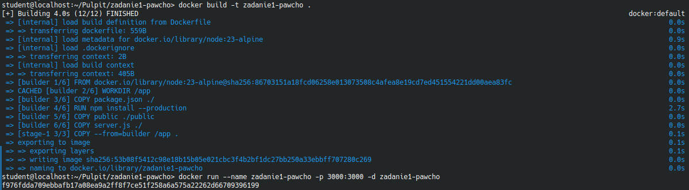
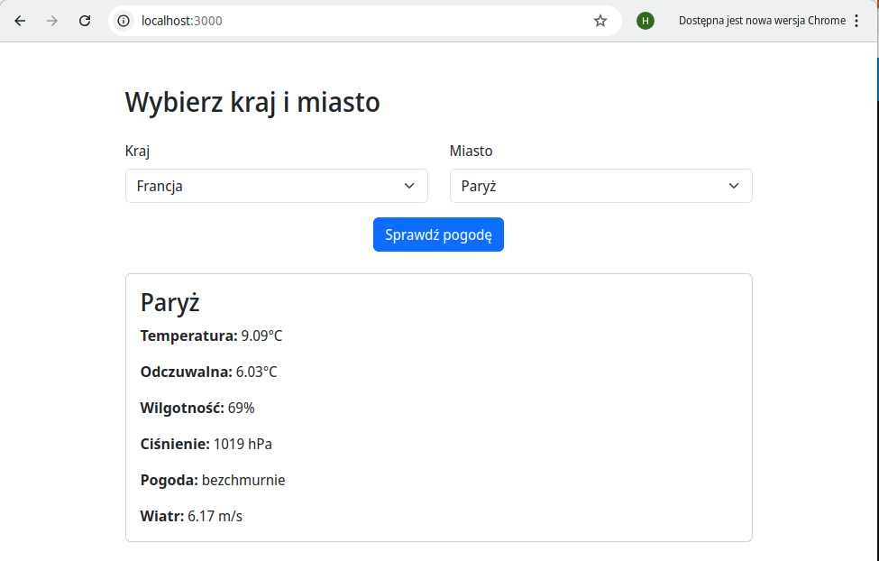
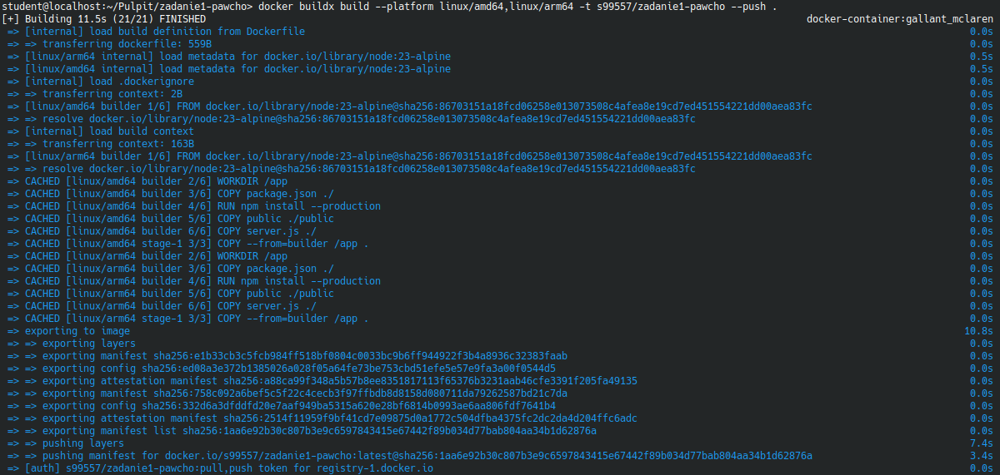
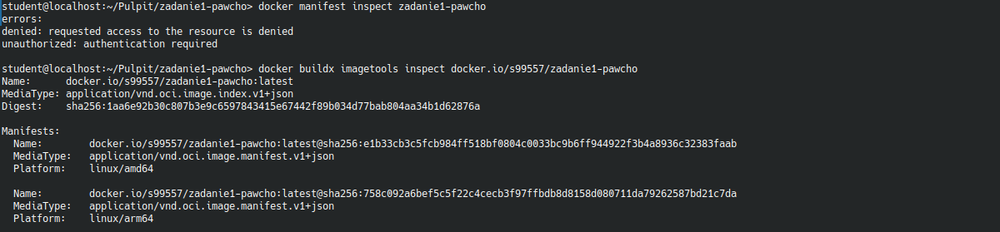
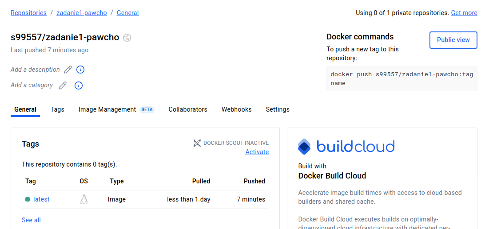

# Zadanie 1 - PAwChO

Autor: Hubert Jędruchniewicz - 99557

## 1.3 - Polecenia:

- a. Zbudowanie opracowanego obrazu kontenera: `docker build -t zadanie1-pawcho .`
- b. Uruchomienie kontenera: `docker run --name zadanie1-pawcho -p 3000:3000 -d zadanie1-pawcho`
- c. Uzyskanie informacji z logów: `docker logs -f zadanie1-pawcho`
- d. Sprawdzenie ilości warstw zbudowanego obrazu: `docker images zadanie1-pawcho`

# Zadanie 1 Dodatkowe - PAwChO

## Polecenia:

- W celu zalogowania do Docker Hub: `docker login`
- Zbudowanie obrazu i umieszczenie na Docker Hub: `docker buildx build --platform linux/amd64,linux/arm64 -t <nazwa-uzytkownika>/zadanie1-pawcho --push .`
- Mainfest obrazu: `docker buildx imagetools inspect docker.io/<nazwa-uzytkownika>/zadanie1-pawcho`

